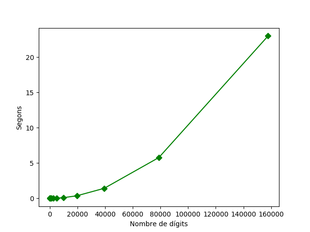
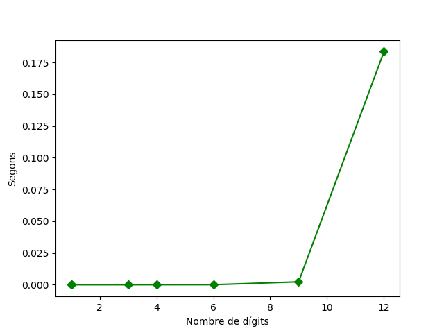
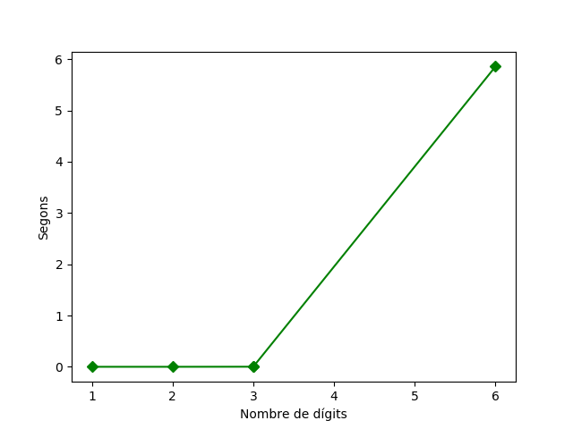
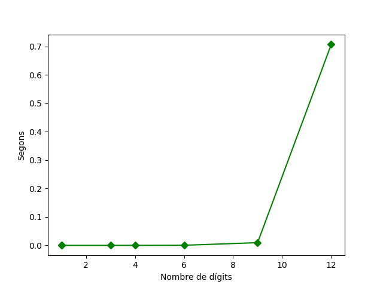
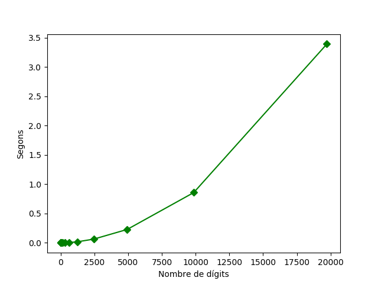
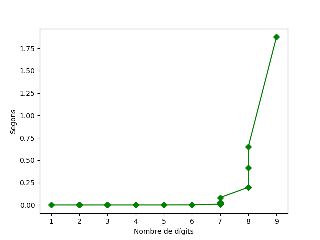

# SPD - Exercici 2: Teoria de números / aritmètica modular

**Autor:** Francesc Xavier Bullich Parra

## A: Càlcul del MCD amb algoritme mcd_euclides

[Veure mcd_euclides a utils.py](https://github.com/fxbp/spd-ex2/blob/master/utils.py)
[Veure fitxer 1_euclides.py](https://github.com/fxbp/spd-ex2/blob/master/1_euclides.py)

L'algoritme d'euclides és molt simple. Es va dividint el dividend pel divisor i es compara el residu amb 0.

- Si el residu és 0 llavors el resultat del mcd es el divisor actual.
- Si el residu és diferent de 0 llavors el divisor passa a ser el divident, i el residu passa a ser el proper divisor.

Utilitzant la funcio mcd_input veiem alguns exemples de funcionament:

```
python 1_euclides.py
entreu un dividend natural positiu: 48
entreu un divisor natural positiu: 36
Dividend:  48
Divisor:  36
MCD:  12
2
Temps invertit: 0.0000202000 segons
```

```
python 1_euclides.py
entreu un dividend natural positiu: 5158215025
entreu un divisor natural positiu: 15684911025
Dividend:  5158215025
Divisor:  15684911025
MCD:  25
Temps invertit: 0.0000244000 segons
```

### Prova de complexitat nombre de digits/temps_final

Per provar la complexitat d'aquest mètode vaig provant de buscar el MCD de diferents nombres generats aleatoriament. Es realitzen varies iteracións en la que cada una duplica el nombre de digits de l'anterior. Començant per 2 dígits i fins uns 160.000 dígits. Veure funció mcd_rep del fitxer 1_euclides.py.

Es mostra el gràfic resultant:



Les dades més significatives son:
 - n = 40.000, t = 1,2
 - n = 80.000, t = 5,3
 - n = 160.000, t = 22,11

Es pot observar que per cada cop que es duplica el nombre de digits la relació en temps creix mes o menys en un factor de 4.
Podem determinar que la complexitat d'aquest métode entra dins de la complexitat polinòmica.

## B: Càlcul del MCD amb l'algoritme de la identitat de Bezoud.

[Veure bezoud a utils.py](https://github.com/fxbp/spd-ex2/blob/master/utils.py)
[Veure fitxer 2_bezoud.py](https://github.com/fxbp/spd-ex2/blob/master/2_bezoud.py)

La identitat de Bezoud determina que el MCD de 2 valors es pot expressar com a una combinació lineal d'enters.
Ens diu que existeixen 2 nombres enters que satisfant la formula MCD = r*dividend + s*divisor

Si dividend i divisor tenen un MCD diferent de 1 aquests números seran 1 i -1 o viceversa.
Altrament ens donarà uns nombres que podem utilitzar posteriorment per el calcul d'operacions d'aritmètica modular.
L'algoritme utilitza el mateix esquema que el d'Euclides, afegint més variables que controlen els valors de r i s.
Per tant pel mateix preu d'executar l'algoritme d'euclides podrem trobar els nombres de l'identitat de Bezoud.

r i s S'obtenen amb una finestra de 2 nombres anteriors que comencen

- rAnt = 0, rAnt2 = 1
- sAnt = 1, sAnt2 = 0

s actual s'obte del quocient de la divisió actual --> quocient * sAnt + sAnt2
r actual s'obte del quocient de la divisió actual --> quocient * rAnt + rAnt2

També s'ha de tenir en compte el nombre de la iteració actual. Si es parell s sera negatiu, si es senar r sera negatiu.

Prova d'execució de l'algoritme de Bezoud:

```
python 2_bezout.py
entreu un dividend natural positiu: 48
entreu un divisor natural positiu: 36
Dividend:  48
Divisor:  36
MCD: mcd = 12, r = 1, s=-1
Comprovacio 12 = 1 * 48 + -1*36
Temps invertit: 0.0000262000 segons
```

```
python 2_bezoud.py
entreu un dividend natural positiu: 508
entreu un divisor natural positiu: 355
Dividend:  508
Divisor:  355
MCD: mcd = 1, r = -58, s=83
Comprovacio 1 = -58 * 508 + 83*355
Temps invertit: 0.0000811000 segons
```

### Complexitat digits/temps

Com he comentat l'algoritme de Bezout segueix el mateix esquema que l'algoritme d'euclides per el que la gràfica serà similar al del mètode anterior. Per tant es pot dir que la complexitat també és polinomica.

## C: Test de primalitat amb algorimte fins sqr(n)


[Veure fitxer 3_test_primalitat.py](https://github.com/fxbp/spd-ex2/blob/master/3_test_primalitat.py)

Com hem vist a classe si comparem amb la xifra sqrt(n) podriem deduir que aquest algorimte podria ser polinomic, pero si ho mirem per nombre de bits resulta que la complexitat és exponencial.

Veiem algun exemple

```
python 3_test_primalitat.py
Provant si 1000000000100011 es primer
True
15.3277976 segons
```

### Complexitat digits/temps

Com podem observar en el seguent gràfic, per a uns 9 digits el temps que tarda es prou bo.
A la que tenim nombres una mica més grans el test de primalitat es dispara en el temps.
Com s'aprecia en la prova anterior de 16 dígits ja arriba a tardar uns 15 segons. Aixó es 75 cops més que el de 12 xifres. Per tant podem concluir que efectivament el test de primalitat té una complexitat exponencial.

En aquest cas per provar la complexitat es generen nombres aleatoriament i es van provant. Si no son primers no es guarda el temps que ha tardat i es prova amb un altre nombre random del mateix nombre de digits. Així podem trobar sempre el pitjor cas.



## D: Test primalitat amb petit teorema de fermat

[Veure fitxer 4_fermat.py](https://github.com/fxbp/spd-ex2/blob/master/4_fermat.py)

Es pot passar un test de primalitat alternatiu utilitzant aritmètica modular. Segons el petit teorema de fermat, per a qualsevol valor p, existeix una formula que ens indica si u nombre és primer o no.

La concició que ha de passar perque sigui un nombre primer és que: Per tot enter a de 1 a p-1, a^(p-1) es congruent a 1 modul p
Si ens fixem amb la formula es pot veure que el que es busca es que a no sigui divisor de p ja que es comprova que sigui de la classe de 1 modul p.
Per exemple si agafem qualsevol a per un p primer i fem a^(p-1)-1 ens donarà que es congruent amb 0 en modul p és a dir que es un divisor.

Amb la condició de "per tot" ens assegurem que p no tingui cap divisor inferior a ell i per tant que és primer.

### PseudoPrimers

D'altra banda existeixen números que compleixen el test de fermat en alguns casos. Es a dir que per alguns enters a, es compleix a(p-1) congruent 1 modul p.

Això però només passa si el a concret i p son coprimers, es a dir qe no son divisors.

Aquests nombres capaços de passar el test de Fermat en alguns casos son coneguts com a nombres de Carmichael.
Com he comentat però no son capaços de passar el test complet de Fermat, sino que només el poden passar amb els a que siguin coprimers amb p. Això és facil d'entendre. Si agafem un enter a qualsevol que no sigui coprimer amb p, es a dir que sigui divisor de p, evidenment no podria passar el test de Fermat, ja que n'acabem de trovar un divisor.

Amb un exemple es veura facilment.
Si agafem el nombre 561 (que es el primer de la serie de Carmichael) podem veure que es descomposa amb el factor de 3 primers.

```
561 = 3 * 11 * 17
```

Provem dons amb a = 3. Si s'aplica directament Fermat (per tot a^(p-1) congruent amb 1 mod p) es pot veure facilment que ja no compleix.

```
3^(560) es congruent amb 375 modul 561
```

D'altra banda podem dir que és un nombre de Carmichael perque les a que no siguin coprimers amb p, (tots els enters de 1 a 560, menys el 3,11 i 17) cumplirant el teorema de Fermat.

Si mirem al fitxer 4_fermat, a la funcio carmichael(n) Es pot veure que abans d'aplicar el teorema de fermat per l'enter a actual, es comprova que a sigui coprimer amb p. Si no es compleix aquesta condició, ja no es prova la resta, ja que donaria negatiu.

Tot i que el 561 no passa el test de primalitat de Fermat, podria existir algun nombre pseudoprimer si que el complis i per tant es diu que la condició mencionada anteriorment és necessaria pero no suficient per validar la primalitat d'un nombre.

Algunes proves:
```
python 4_fermat.py
Test primalitat Fermat de:  561
False
Test nombre charmicael de:  561
True
```

```
python 4_fermat.py
Test primalitat Fermat de:  541
True
Test nombre charmicael de:  541
False
```

### Càlcul de complexitat digits/temps

Com que s'esta provant el test de primalitat, per obtenir els casos extrems, es generen nombres aleatoris, i es calcula el temps d'aquells que siguin primers, ja que hauràn de passar el test complet.

Si ens possem en el pitjor cas, que el nombre probat sigui primer, Pel teorema de Fermat s'hauran de fer p-1 iteracions. D'altra banda tenim que l'algoritme intern que s'utilitza per calcular la congruencia de a^(p-1) amb 1 modul p, te un cost polinomic (s'utilitza l'algoritme podentica_modular_eficient), que com s'ha explicat a classe te un cost polinomic. Així doncs el cost segueix sent polinómic però es pot veure que el temps creix rapidament en funció del nombre de dígits.

Veiem el gràfic resultant:




## E: Descomposicio en factors primers

[Veure factors_primers a utils.py](https://github.com/fxbp/spd-ex2/blob/master/utils.py)
[Veure fitxer 5_factoritzar.py](https://github.com/fxbp/spd-ex2/blob/master/5_factoritzar.py)


La descomposició de nombres en factors primers te la mateixa complexitat que la del test de primalitat normal. L'algoritme és el mateix pero en comptes de parar quan trobem un divisor, es continua fins arrel(n) ja que necessita trobar tots els divisors del nombre. per tant podrem veure que el grafic serà similar. En aquest cas no és necessari mirar si el nombre es primer abans ja que qualsevol nombre fara tots els passos.

Alguns exemples:

```
python 5_factoritzar.py
Factorització en nombres primers de:  561
[3, 11, 17]
```

```
python 5_factoritzar.py
Factorització en nombres primers de:  545610561620048
[2, 2, 2, 2, 3019, 22153, 509879]
```

### Càlcul de la complexitat digits/temps

Com ja he comentat la complexitat es la mateixa que la del test de primalitat en el pitjor cas per tant podem concluir que també serà una complexitat exponencial.



Com es pot veure el gràfic es molt similar al del test de primalitat.

## F: Càlcul de l'invers modular a Z/n

[Veure fitxer 6_Invers_modular.py](https://github.com/fxbp/spd-ex2/blob/master/6_Invers_modular.py)

Trobar l'invers modular serveix per poder dividir en mod n. Com que es treballa amb nombres enters no podem fer la divisió com la coneixem a Z/n. El resultat de l'invers modular també serà un nombre enter de 0 a n-1 (mod n).

Una forma eficient de trobar l'invers modular és utilitzar l'algoritme d e Bezout. Els nombres r i s, quan el mcd del nombre i la n, del mod n, és 1, s és l'invers modular del nombre en questió.

Recordem que els nombres r i s multiplicaven al dividend i al divisor. En aquest cas un dels 2 és el propi N de Z/n. Per tant r*n ens donara sempre que és un divisor de n, es congruent a 0 en mod n. Per tant el resultat es s (mod n). Si el nombre s es negatiu, al aplicar el mod n ja quedarà com a una de les possibles classes de n a Z/n.

Alguns exemples:

```
python 6_Invers_modular.py
entreu un enter al que voleu buscar invers (mod n) 45879
entreu el modul: 4587931
Invers modular de  45879 a (mod 4587931)
45879^(-1) (mod 4587931) = 4439930
```

```
python 6_Invers_modular.py
entreu un enter al que voleu buscar invers (mod n) 128
entreu el modul: 405
Invers modular de  128 a (mod 405)
128^(-1) (mod 405) = 212
```

### Complexitat en dígits/temps.

Com s'ha comentat, s'utilitza l'algoritme de Bezout i aquest utilitza el mateix esquema que l'algorimte d'Euclides per el MCD.
Només és pot calcular l'invers modular d'aquells nombres que son coprimers amb n. D'aqui es pot extreure que per als nombres primers, tots els enters menors que n, menys el 0, seran inversibles en mod n.

Per tant la complexitat serà també polinomica.



## G: Exponenciacio modular a Z/n

[Veure potencia_modular_eficient a utils.py](https://github.com/fxbp/spd-ex2/blob/master/utils.py)
[Veure fitxer 7_exponent_modular.py](https://github.com/fxbp/spd-ex2/blob/master/7_exponent_modular.py)

En aritmética modular es pot aprofitar una de les propietats de la multiplicació: a*b (mod n) es congruent amb (a (mod n)) * (b (mod n)) (mod n).

Exportat a la exponeciació es tradueix en que és pot trobar un algoritme de complexitat polinomica per trobar el resluttat. Per tant reduir el cost.

Exemple:

```
python 7_exponent_modular.py
entreu la n de Z/n: 5
Entreu la base: 48
Entreu l'exponent : 57
Exponenciacio modular 48 de 57 = 3 (mod 5)
```

### Complexitat en dígits/temps.

Veiem un gràfic on es va modificant la base i l'exponent per intentar veure el cost polinomic de l'algoritme



## H: Càlcul del logaritme discret a Z/n

[Veure fitxer 8_logaritme_discret.py](https://github.com/fxbp/spd-ex2/blob/master/8_logaritme_discret.py)

Pel contrari que la exponenciació modular, trobar el valor del logaritme discret a Z/n té un cost exponencial. Doncs s'ha danar provant per a cada enter si és o no logarimte discret del valor.

Per fer-ho dons s'utilitza la potencia_modular_eficient, fent el canvi de paràmetres pertinents. Per a cada enter, es comprova que l'argument del logaritme sigui el resultat de l'exponent modular passant el nombre provat com a exponent de l'operacio.

Alguns exemples simples:

```
python 8_logaritme_discret.py
entreu la n de Z/n: 5
Entreu la base del logaritme discret: 2
Entreu l'argument del logaritme discret: 3
Logaritme discret en base 2 de 3 = 3 (mod 5)
```

```
python 8_logaritme_discret.py
entreu la n de Z/n: 23
Entreu la base del logaritme discret: 3
Entreu l'argument del logaritme discret: 12
Logaritme discret en base 3 de 12 = 4 (mod 23)
```

```
pandoc README.md -o README.pdf --from markdown --template eisvogel --listings
```
